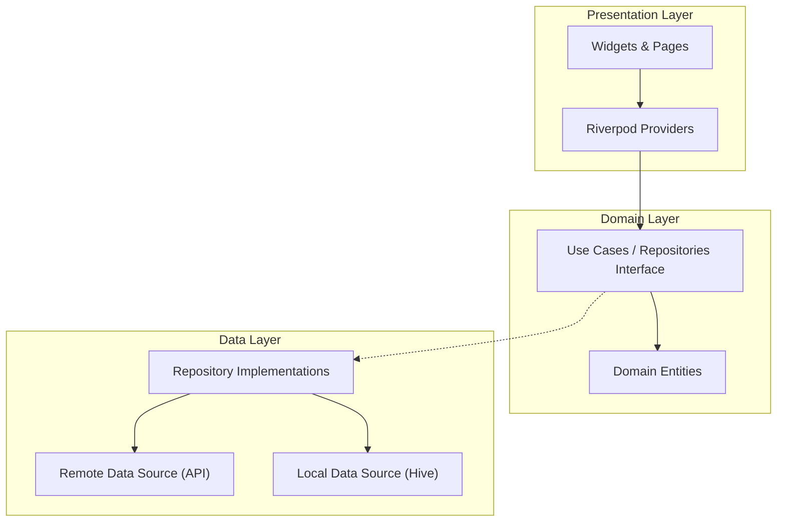

# Browser Lite

**Browser Lite** is a lightweight, AI-powered web browser built with Flutter. It integrates Google's Gemini AI to provide intelligent features like web page summarization and translation, enhancing the browsing experience with on-demand content analysis.

## 🏗️ Architecture

This project follows **Clean Architecture** principles to ensure separation of concerns, scalability, and testability.



- **Presentation Layer**: Handles UI and state management using **Riverpod**.
- **Domain Layer**: Contains business logic and interfaces, independent of external frameworks.
- **Data Layer**: Manages data retrieval from the Gemini API and local storage using **Hive**.

## 🚀 Setup & Run Instructions

### Prerequisites

- [Flutter SDK](https://flutter.dev/docs/get-started/install) (version 3.0.0 or later)
- A valid [Google Gemini API Key](https://ai.google.dev/)

### Installation

1.  **Clone the repository:**

    ```bash
    git clone https://github.com/neeraj150301/browser_lite.git
    cd browser_lite
    ```

2.  **Install dependencies:**

    ```bash
    flutter pub get
    ```

3.  **Configure Environment Variables:**
    Create a `.env` file in the root directory and add your API key:

    ```env
    GEMINI_API_KEY=YOUR_GEMINI_API_KEY
    ```

4.  **Run the app:**
    ```bash
    flutter run
    ```

## 📦 Key Packages & Versioning

This project uses **Semantic Versioning** (1.0.0+1).

| Package                 | Purpose                                                    |
| :---------------------- | :--------------------------------------------------------- |
| `flutter_riverpod`      | State management and dependency injection.                 |
| `hive` / `hive_flutter` | Lightweight and fast key-value database for local storage. |
| `google_generative_ai`  | SDK for accessing Google's Gemini models.                  |
| `flutter_inappwebview`  | A feature-rich WebView for Flutter.                        |
| `dio`                   | Powerful HTTP client for Dart.                             |

## 🧠 State Management & Storage

- **State Management**: **Riverpod** is used for its compile-time safety and flexibility. It manages the state of the browser, AI interactions, and theme settings, ensuring a reactive UI.
- **Storage**: **Hive** is utilized for persisting user preferences and browser history locally. It is chosen for its high performance and ease of use with Flutter.

## 🔄 API Flow: Summarization & Translation

The AI features are powered by the `AiService` which interacts with the Gemini API.

1.  **User Action**: User clicks "Summarize" or "Translate" in the `SummaryPanel`.
2.  **Provider Call**: The UI calls a method in the `SummaryProvider`.
3.  **Repository Delegation**: The provider delegates the request to the `SummaryRepository`.
4.  **AI Service Execution**:
    - **Summarization**: `AiService.summarize(text)` sends a prompt to Gemini to summarize the content.
    - **Translation**: `AiService.translate(text, language)` sends a prompt to translate the text.
5.  **Response Handling**: The result is returned through the layers back to the UI for display.

## ⚠️ Known Limitations & Future Improvements

### Limitations

- **Gemini API rate limits**: Heavy usage may hit Gemini API rate limits.
- **Text-Only AI**: Currently processes text content; does not analyze images or complex page structures.
- **Web security (CORS / sandbox)**: On web, iframe contents (DOM) cannot be fully read for cross-origin pages, limiting pure in-browser extraction.
- **File support on Web**: Local FileSystem APIs via dart:io aren’t available, for now, rich file management + document summarization is focused on mobile.

### Future Improvements

- [ ] **Full speech-to-text for voice URL input.**
- [ ] **Extend AI panel with quick insights.**
- [ ] **Language detection.**
- [ ] **Better animations (Lottie) for loading states.**
